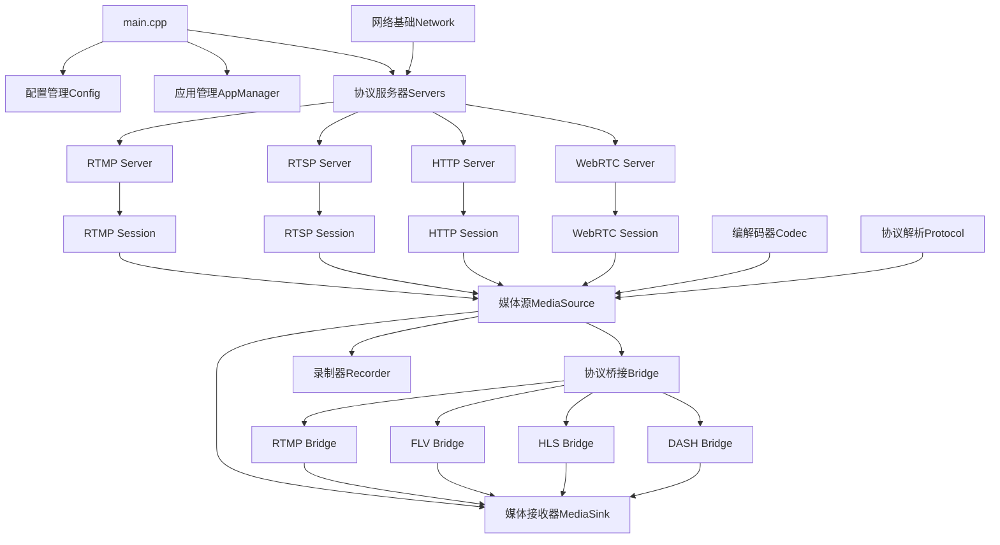
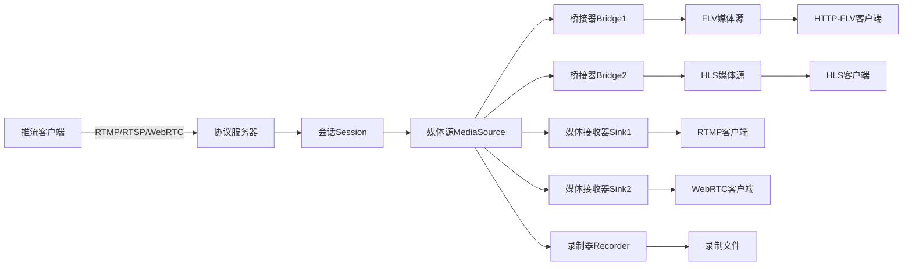

# MMS多媒体服务器项目结构文档

## 1. 项目架构概览

MMS (Multi Media Server) 是一个高性能的多媒体流媒体服务器，支持多种协议的推拉流、协议转换、录制和媒体分发功能。

### 1.1 核心特性

- **多协议支持**: RTMP/RTMPS, RTSP/RTSPS, HTTP/HTTPS, WebRTC, HLS, DASH
- **协议转换**: 支持不同协议之间的实时转换
- **高并发**: 基于Boost.Asio异步I/O框架
- **媒体编解码**: 支持H.264/H.265, AAC, Opus, G.711等编解码器
- **录制功能**: 支持FLV, MP4, HLS等格式录制
- **负载均衡**: 支持集群部署和负载均衡

### 1.2 架构层次

```
┌─────────────────────────────────────────────────────────┐
│                    应用层 (Application)                  │
├─────────────────────────────────────────────────────────┤
│                  协议服务器层 (Protocol Servers)         │
├─────────────────────────────────────────────────────────┤
│                   桥接转换层 (Bridge Layer)               │
├─────────────────────────────────────────────────────────┤
│                   媒体核心层 (Media Core)                 │
├─────────────────────────────────────────────────────────┤
│                   协议解析层 (Protocol Layer)            │
├─────────────────────────────────────────────────────────┤
│                   编解码器层 (Codec Layer)               │
├─────────────────────────────────────────────────────────┤
│                   网络基础层 (Network Base)              │
└─────────────────────────────────────────────────────────┘
```

## 2. 主要目录结构及其职责

### 2.1 libs/ - 核心库模块

```
libs/
├── base/               # 基础组件库
│   ├── network/        # 网络通信组件
│   ├── thread/         # 线程管理组件
│   ├── utils/          # 工具类
│   └── ...
├── codec/              # 编解码器库
│   ├── h264/           # H.264编解码
│   ├── hevc/           # H.265编解码
│   ├── aac/            # AAC编解码
│   └── ...
├── protocol/           # 协议解析库
│   ├── rtmp/           # RTMP协议
│   ├── rtsp/           # RTSP协议
│   ├── http/           # HTTP协议
│   ├── rtp/            # RTP协议
│   └── ...
├── server/             # 服务器基础框架
│   ├── tcp/            # TCP服务器
│   ├── udp/            # UDP服务器
│   └── tls/            # TLS服务器
└── sdk/                # SDK开发包
```

### 2.2 live-server/ - 主应用程序

```
live-server/
├── app/                # 应用管理层
│   ├── app_manager.*   # 应用管理器
│   ├── publish_app.*   # 推流应用
│   └── play_app.*      # 拉流应用
├── bridge/             # 协议桥接层
│   ├── rtmp/           # RTMP相关桥接
│   ├── rtsp/           # RTSP相关桥接
│   ├── webrtc/         # WebRTC相关桥接
│   └── ...
├── core/               # 媒体核心层
│   ├── media_source.*  # 媒体源基类
│   ├── media_sink.*    # 媒体接收器基类
│   └── ...
├── server/             # 协议服务器实现
│   ├── rtmp/           # RTMP服务器
│   ├── rtsp/           # RTSP服务器
│   ├── http/           # HTTP服务器
│   └── webrtc/         # WebRTC服务器
├── config/             # 配置管理
├── recorder/           # 录制功能
└── main.cpp            # 程序入口
```

## 3. 关键模块的依赖关系图



## 4. 核心类和接口的功能说明

### 4.1 MediaSource - 媒体源基类

```cpp
class MediaSource : public std::enable_shared_from_this<MediaSource> {
public:
    // 添加/移除媒体接收器
    virtual bool add_media_sink(std::shared_ptr<MediaSink> media_sink);
    virtual bool remove_media_sink(std::shared_ptr<MediaSink> media_sink);
    
    // 获取或创建桥接器
    virtual std::shared_ptr<MediaBridge> get_or_create_bridge(const std::string & id, 
                                                              std::shared_ptr<PublishApp> app,
                                                              const std::string & stream_name) = 0;
    
    // 流状态管理
    virtual bool is_stream_ready();
    virtual void close();
    
    // 元数据获取
    const std::string & get_domain_name() const;
    const std::string & get_app_name() const;
    const std::string & get_stream_name() const;
    bool has_video() const;
    bool has_audio() const;
};
```

**功能**:

- 媒体流的统一抽象，是数据流的起点
- 管理所有连接到该流的媒体接收器
- 负责媒体流的生命周期管理
- 支持多种协议的媒体源实现

### 4.2 MediaSink - 媒体接收器基类

```cpp
class MediaSink : public std::enable_shared_from_this<MediaSink> {
public:
    // 设置媒体源
    void set_source(std::shared_ptr<MediaSource> source);
    std::shared_ptr<MediaSource> get_source();
    
    // 生命周期管理
    virtual void close();
    void on_close(const std::function<void()> & close_cb);
    
    // 状态变化回调
    void on_source_status_changed(SourceStatus status);
};

class LazyMediaSink : public MediaSink {
public:
    virtual void wakeup();
    virtual boost::asio::awaitable<void> do_work() = 0;
};
```

**功能**:

- 媒体流的消费者，是数据流的终点
- 支持懒加载模式，按需启动
- 处理媒体源状态变化事件

### 4.3 Codec - 编解码器基类

```cpp
enum CodecType {
    CODEC_H264  = 0,
    CODEC_HEVC  = 1,
    CODEC_AAC   = 2,
    CODEC_MP3   = 3,
    CODEC_AV1   = 4,
    CODEC_OPUS  = 5,
    CODEC_G711_ALOW = 6,
    CODEC_G711_ULOW = 7,
};

class Codec {
public:
    virtual bool is_ready();
    void set_data_rate(uint32_t v);
    uint32_t get_data_rate();
    virtual Json::Value to_json();
};
```

**功能**:

- 编解码器的统一抽象
- 支持多种音视频编解码格式
- 提供编解码参数配置和状态查询

### 4.4 服务器类架构

```cpp
// TCP服务器基类
class TcpServer {
public:
    bool start(uint16_t port);
    void stop();
};

// 协议服务器实现
class RtmpServer : public TcpServer, public SocketInterfaceHandler;
class RtspServer : public UdpServer, public TcpServer, public SocketInterfaceHandler;
class WebRtcServer : public UdpServer, public WebRtcServerSessionCloseHandler;
class HttpLiveServer : public HttpServerBase;
```

**功能**:

- 提供统一的服务器启动和管理接口
- 支持TCP/UDP双栈
- 集成TLS/SSL安全传输

## 5. 数据流向图



### 5.1 推流数据流

1. **接入**: 客户端通过RTMP/RTSP/WebRTC推送媒体流
2. **解析**: 协议服务器解析协议数据包
3. **会话**: 创建对应的服务器会话Session
4. **媒体源**: 会话创建对应的MediaSource
5. **分发**: MediaSource将数据分发给所有连接的Sink和Bridge

### 5.2 拉流数据流

1. **请求**: 客户端发起拉流请求
2. **查找**: 根据流标识查找对应的MediaSource
3. **创建**: 创建对应的MediaSink
4. **连接**: 将MediaSink连接到MediaSource
5. **传输**: MediaSource向MediaSink推送媒体数据

### 5.3 协议转换流

1. **源协议**: 原始推流创建MediaSource
2. **桥接**: 创建对应的MediaBridge
3. **转换**: Bridge进行协议和格式转换
4. **目标源**: 生成新的MediaSource
5. **分发**: 新的MediaSource支持目标协议的拉流

## 6. API接口清单

### 6.1 HTTP API接口

服务器提供RESTful API用于管理和监控：

#### 6.1.1 流管理API

```
GET    /api/v1/streams                    # 获取所有流列表
GET    /api/v1/streams/{domain}/{app}     # 获取指定应用的流
DELETE /api/v1/streams/{domain}/{app}/{stream}  # 断开指定流
```

#### 6.1.2 服务器状态API

```
GET    /api/v1/server/stat               # 获取服务器统计信息
GET    /api/v1/server/config             # 获取服务器配置
POST   /api/v1/server/reload             # 重新加载配置
```

#### 6.1.3 录制管理API

```
POST   /api/v1/record/start              # 开始录制
POST   /api/v1/record/stop               # 停止录制
GET    /api/v1/record/list               # 获取录制文件列表
```

### 6.2 WebSocket API

```
ws://server:port/ws/v1/stat              # 实时统计信息推送
ws://server:port/ws/v1/events            # 事件通知推送
```

### 6.3 推拉流URL格式

#### 6.3.1 RTMP

```
推流: rtmp://server:1935/app/stream
拉流: rtmp://server:1935/app/stream
```

#### 6.3.2 RTSP

```
推流: rtsp://server:554/app/stream
拉流: rtsp://server:554/app/stream
```

#### 6.3.3 HTTP-FLV

```
拉流: http://server:80/app/stream.flv
```

#### 6.3.4 HLS

```
播放列表: http://server:80/app/stream.m3u8
```

#### 6.3.5 WebRTC

```
信令: ws://server:8080/webrtc/app/stream
```

## 7. 常见的代码模式和约定

### 7.1 命名约定

- **命名空间**: 统一使用`mms`命名空间
- **类名**: 使用PascalCase，如`MediaSource`, `RtmpServer`
- **成员变量**: 使用snake_case并以下划线结尾，如`media_type_`, `worker_`
- **函数名**: 使用snake_case，如`get_stream_name()`, `add_media_sink()`
- **常量**: 使用全大写+下划线，如`CODEC_H264`, `E_SOURCE_STATUS_INIT`

### 7.2 内存管理模式

- **智能指针**: 大量使用`std::shared_ptr`和`std::weak_ptr`管理对象生命周期
- **RAII**: 资源获取即初始化，利用析构函数自动清理资源
- **对象追踪**: 使用`ObjTracker`模板进行对象计数和调试

### 7.3 异步编程模式

- **协程**: 使用Boost.Asio的协程机制，`boost::asio::awaitable<T>`
- **线程池**: 使用`ThreadWorker`和`thread_pool_inst`管理线程
- **同步原语**: 使用`WaitGroup`进行跨协程同步

### 7.4 错误处理模式

```cpp
// 使用错误码枚举
enum SourceStatus {
    E_SOURCE_STATUS_INIT = 0,
    E_SOURCE_STATUS_READY = 1,
    E_SOURCE_STATUS_ERROR = 2,
};

// 使用回调函数处理状态变化
void on_source_status_changed(SourceStatus status);

// 使用异常和错误码结合
try {
    if (!config->load_config(config_path)) {
        return -3;  // 错误码返回
    }
} catch (std::exception &exp) {
    CORE_ERROR("load config failed, err:{}", exp.what());
    return -4;
}
```

### 7.5 配置管理模式

- **YAML配置**: 使用YAML格式的配置文件
- **单例模式**: `Config::get_instance()`获取配置实例
- **分层配置**: 支持全局配置和应用级配置
- **热重载**: 支持配置的动态重新加载

### 7.6 日志记录模式

```cpp
// 使用spdlog进行日志记录
#include "log/log.h"

CORE_INFO("start rtmp server on port:{} succeed", port);
CORE_ERROR("start rtmp server on port:{} failed", port);
CORE_DEBUG("processing frame: {}", frame_id);
```

### 7.7 工厂模式

```cpp
// 桥接器工厂
class BridgeFactory {
public:
    static std::shared_ptr<MediaBridge> create_bridge(
        ThreadWorker *worker, 
        const std::string & id, 
        std::shared_ptr<PublishApp> app,
        std::weak_ptr<MediaSource> origin_source,
        const std::string & domain_name, 
        const std::string & app_name, 
        const std::string & stream_name
    );
};
```

### 7.8 观察者模式

```cpp
// 媒体事件通知
class MediaSource {
    void notify_status(SourceStatus status);
};

class MediaSink {
    void on_source_status_changed(SourceStatus status);
    void set_on_source_status_changed_cb(
        const std::function<boost::asio::awaitable<void>(SourceStatus)> & cb
    );
};
```

这种架构设计使得MMS服务器具有高度的模块化、可扩展性和可维护性，支持多种协议的统一处理和灵活的协议转换能力。